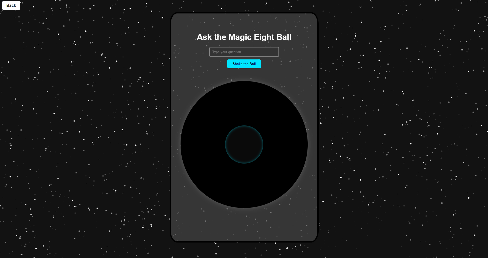

# Magic 8-Ball

A simple little Magic 8-Ball that answers your yes/no questions with the original responses. Built with HTML, CSS, and JavaScript.
I'm planning on making a bunch of things as a divination series (e.g coin flip, tarot cards, etc.), and this is the first

## Features
- the 20 original Magic 8-Ball answers
- responsive design for desktop and mobile (well kind of)
- it shakes! it's cute!
- fun background with [particle.js](https://github.com/VincentGarreau/particles.js/)

## License
absolutely none! do whatever you like! (technically it's the unlicense but whatever)